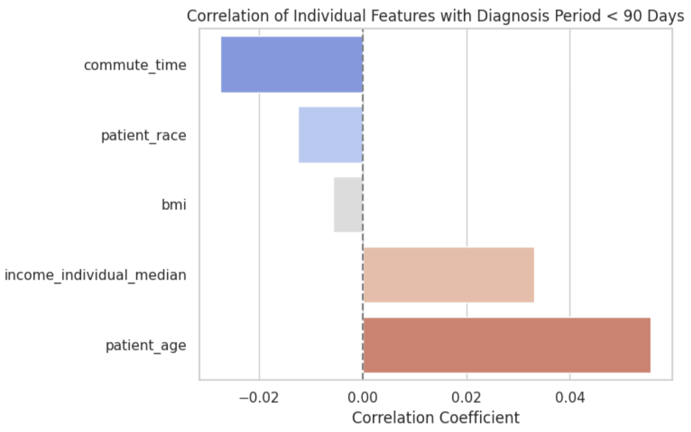
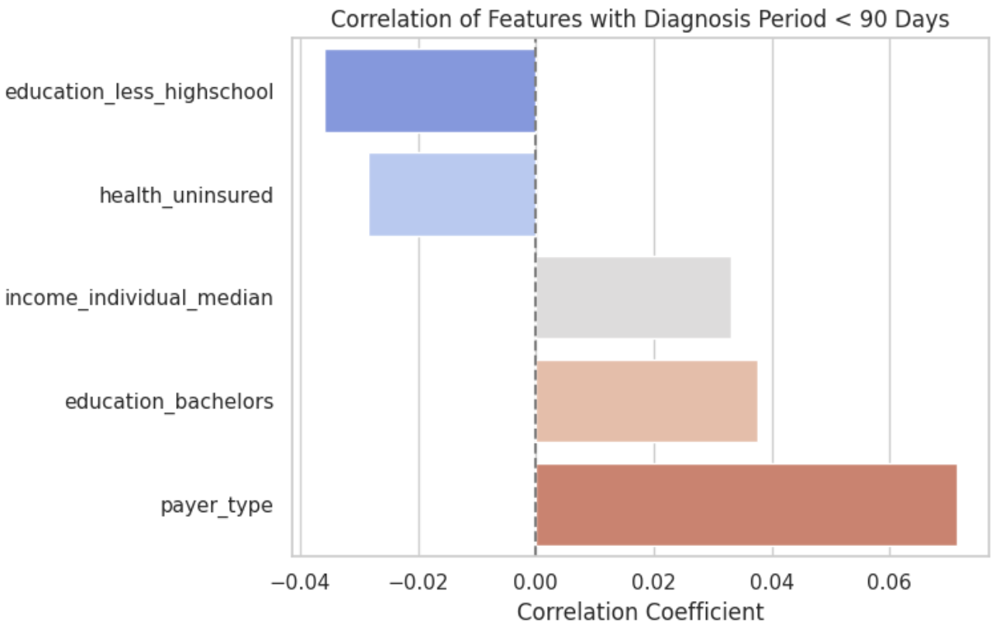
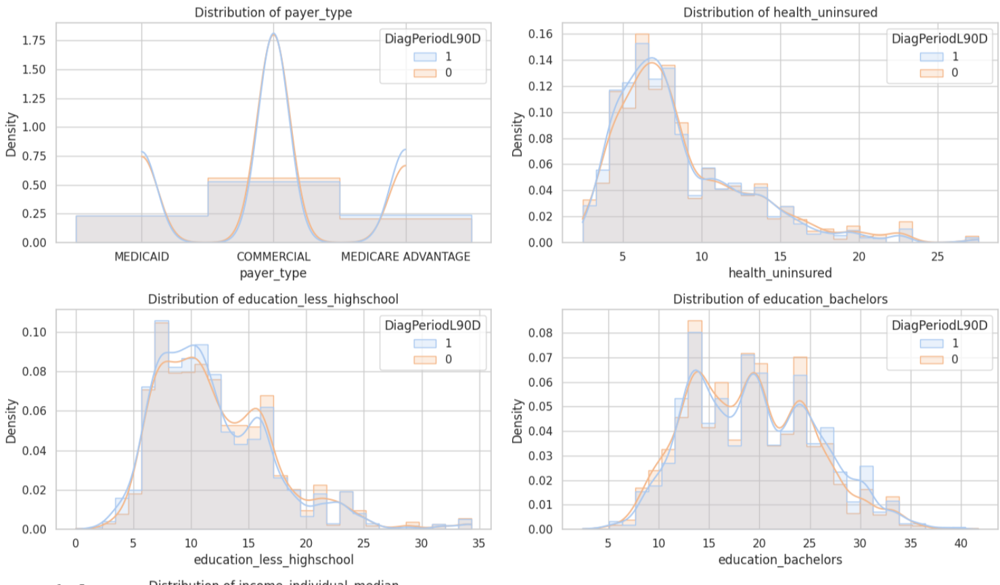
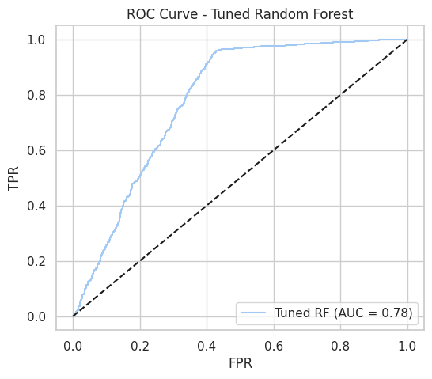

# Breast Cancer Diagnosis Prediction (WiDS 2024 Challenge)

**One Sentence Summary:** This repository contains a predictive modeling pipeline built to classify breast cancer diagnosis timing using health, demographic, and environmental features, as part of the WiDS Datathon 2024 challenge.

## Overview

The task, as defined by the WiDS 2024 Kaggle challenge, was to predict whether a breast cancer diagnosis occurred within 90 days based on a rich dataset containing patient characteristics, diagnosis codes, geographic and socioeconomic data, and environmental toxicity metrics. Our approach involved rigorous data preprocessing, feature engineering, exploratory data analysis, and the implementation of Logistic Regression and Random Forest models. Our best model achieved an ROC AUC of \~0.78 on validation data.

## Summary of Workdone

### Data

* **Type:** CSV files with structured tabular data

  * Input: patient-level demographic, diagnostic, environmental, and geographic features
  * Output: binary label (`DiagPeriodL90D`) indicating early (<90 days) or late diagnosis
* **Size:** \~18,000 rows in `training.csv`; a separate `test.csv` file for inference

### Preprocessing / Cleanup

* Dropped columns with over 80% missing values
* Imputed:

  * Numerical columns with training-set mean
  * Categorical columns with mode
* Applied Label Encoding to all categorical features consistently across `train_df` and `test_df`
* Clipped outliers in selected key numeric features (e.g., `bmi`, `income`, `pollutants`) using IQR bounds
* Ensured transformations used `train_df` statistics and were applied identically to `test_df`

### Data Visualization

* Plotted missing value bar chart
* Created histograms of features like `patient_age`, `bmi`, `PM25`, `Ozone`, `commute_time`, and `education` grouped by diagnosis period
* Displayed correlation matrix heatmaps


#Corelation and distribution across different groups of features

  
  
  

### Problem Formulation

* **Input:** 70+ features including demographics, pollution levels, and diagnosis codes
* **Output:** Binary classification of diagnosis period (<90 days or not)
* **Models Tried:**

  * Logistic Regression (with feature scaling using `StandardScaler`)
  * Random Forest Classifier:

    * Baseline using default parameters
    * A manually tuned version using common best practices (faster than grid/random search)

### Training

* Performed train/validation split (80/20) using `train_test_split`
* Imputed missing values before scaling or modeling
* Tuned Random Forest using manual hyperparameters:

  * `n_estimators=200`, `max_depth=20`, `min_samples_split=5`, `min_samples_leaf=2`, `class_weight='balanced'`
* All modeling and visualizations conducted using scikit-learn in Google Colab

### Performance Comparison

| Model                         | ROC AUC | 
| ----------------------------- | ------- | 
| Logistic Regression           | \~0.77  | 
| Random Forest (Basic)         | \~0.77  | 
| Random Forest (manual tuning) | \~0.78  |

*  

### Conclusions

* Random Forest was the best-performing model overall with minimal tuning
* Logistic Regression performed well after proper scaling but was outperformed
* Consistent preprocessing and feature handling were crucial to success

### Future Work


* Explore gradient boosting models like LightGBM and XGBoost
* Try automated feature selection or dimensionality reduction (e.g., PCA)
* Prepare for Kaggle submission using prediction file

## How to Reproduce Results

1. Clone this repo and open the notebook in Colab or Jupyter
2. Install required packages (see Software Setup)
3. Run notebook top to bottom:

   * Preprocessing → EDA → Model Training → Evaluation
4. Place `training.csv` and `test.csv` in the root directory

### Overview of Files in Repository

* `Cancer_Diagnosis_Final_Project.ipynb`: full end-to-end pipeline
* `training.csv`: training data (not included; from Kaggle challenge)
* `test.csv`: test data (not included; from Kaggle challenge)

### Software Setup

```bash
pip install pandas numpy matplotlib seaborn scikit-learn
```

### Data

Download from: [WiDS Kaggle Challenge 2024](https://www.kaggle.com/competitions/widsdatathon2024/data)

### Training

* Run all preprocessing and model training cells
* Logistic Regression requires scaled features
* Random Forest model runs both as a baseline and manually tuned version

### Performance Evaluation

* View printed confusion matrix, classification report, and AUC
* Visualize ROC curve and compare model performance

## Citations

* [WiDS Datathon 2024](https://www.kaggle.com/competitions/widsdatathon2024)
* Scikit-learn documentation

